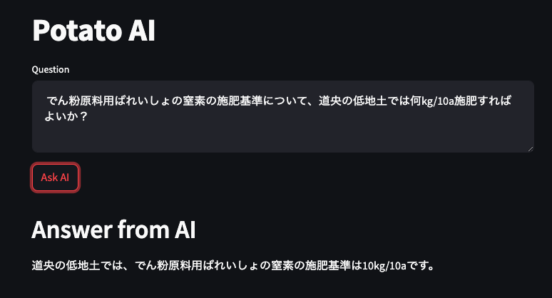
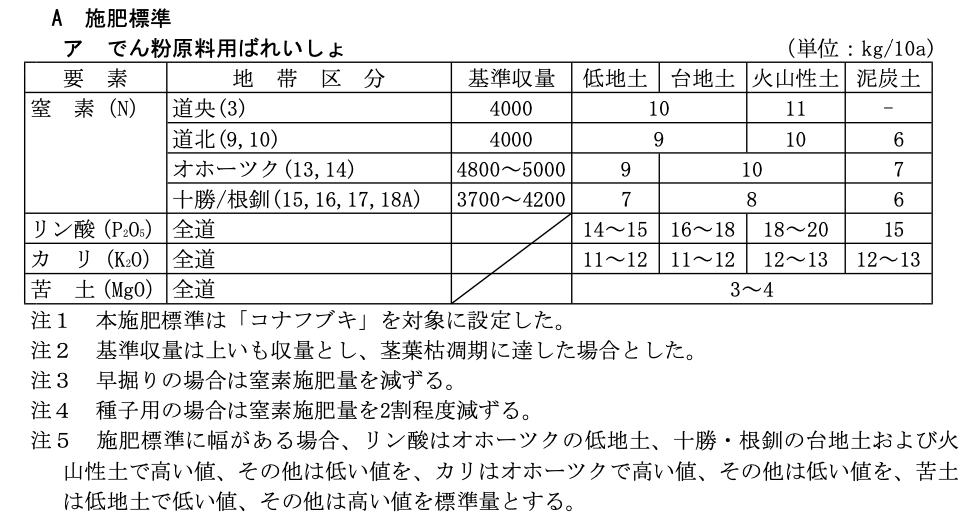

# Potato AI

## Web application


```
$ ./start.sh
```

or

```
$ streamlit python webapp.py
```

## Standalone program


```
python potato.py
```
or 

```
python potato-md.py
```


## PDFから直接読んだ場合
表の構造を理解できない

```
$ python potato.py
```
```
[質問をどうぞ]: でん粉原料用ばれいしょの窒素の施肥基準について、道央の低地土では何kg/10a施肥すればよいか？
```
```
道央の低地土において、でん粉原料用ばれいしょの窒素の施肥基準は、何kg/10a施肥すればよいかは、提供された情報では明確には示されていません。
```

## PDFをMarkdownに変換してから読んだ場合
PDF->MDの変換には次のサイトを使った
[https://pdf2md.morethan.io/](https://pdf2md.morethan.io/)

表の構造を理解している

```
$ python potato-md.py
```
```
[質問をどうぞ]: でん粉原料用ばれいしょの窒素の施肥基準について、道央の低地土では何kg/10a施肥すればよいか？
```
```
道央の低地土では、でん粉原料用ばれいしょの窒素の施肥基準は10kg/10aです。
```
